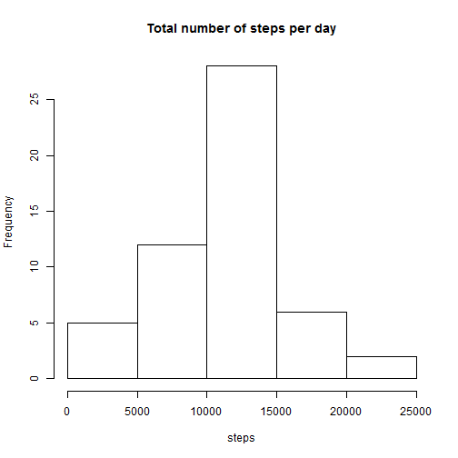
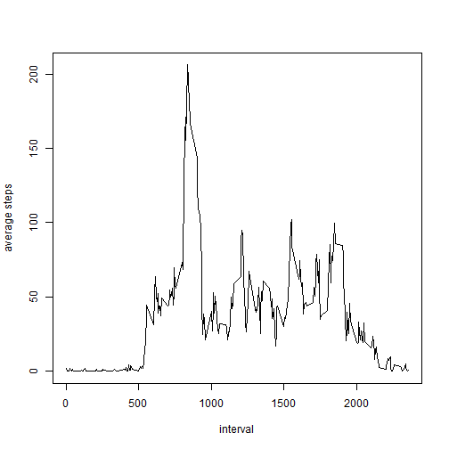
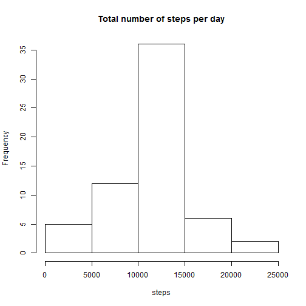
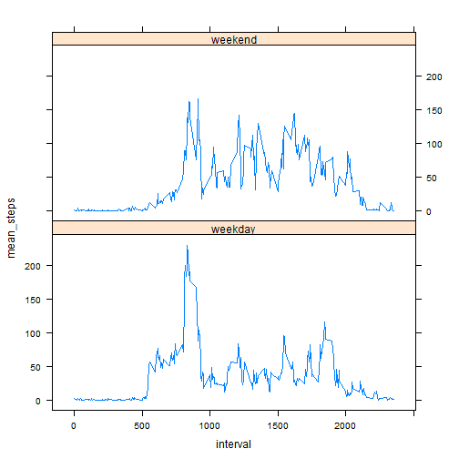

Load data


```r
library(data.table)
library(ggplot2)
library (plyr)
library(lattice)
activity_dt<- fread("activity.csv")
```

Summing up the number of steps per day.

```r
num_steps_per_day<-ddply(activity_dt, ~ date, summarize, steps=sum(steps))
```

**What is mean total number of steps taken per day?**

Plot histogram of the total number of steps taken each day :


```r
hist(num_steps_per_day$steps, main = "Total number of steps per day", xlab = "steps")
```

 


Mean value : 

```r
mean(num_steps_per_day$steps, na.rm=TRUE)
```

```
## [1] 10766.19
```

Median value : 


```r
median(num_steps_per_day$steps, na.rm=TRUE)
```

```
## [1] 10765
```


**Average Daily Activity Pattern**

Time series plot of the 5-minute interval (x-axis) and the average number of steps taken, averaged across all days (y-axis)


```r
mean_per_interval<-ddply(activity_dt, ~interval, summarize, mean_steps=mean(steps, na.rm=TRUE))
plot (mean_per_interval$mean_steps~mean_per_interval$interval,  type="line", xlab="interval", ylab = "average steps")
```

 

Maximum number of steps are in the following 5 minute interval :

```r
r_index<-which.max(mean_per_interval[,2])
mean_per_interval[r_index,]$interval
```

```
## [1] 835
```

**Inputing missing values**

1) Calculate and report the total number of missing values in the dataset (i.e. the total number of rows with NAs)

```r
length(activity_dt$steps[is.na(activity_dt$steps)])
```

```
## [1] 2304
```

2) The strategy used to fill up the missing Values are substituting the missing values with the mean values of the 5 minute interval

3) Create a new dataset that is equal to the original dataset but with the missing data filled in. 

```r
##activity_dt_new is the new data set created
activity_dt_new <- merge(activity_dt,mean_per_interval, by = "interval")
nas <- is.na(activity_dt_new$steps)

## replace missing values with the mean value of 5 minute interval
activity_dt_new$steps[nas] <- activity_dt_new$mean_steps[nas]
num_steps_per_day_new<-ddply(activity_dt_new, ~ date, summarize, steps=sum(steps))
```

Make a histogram of the total number of steps taken each day and Calculate and report the mean and median total number of steps taken per day. 

Q : Do these values differ from the estimates from the first part of the assignment? What is the impact of imputing missing data on the estimates of the total daily number of steps?
A : Values differ from the first part of the assignment. Total number of steps increased. Max frequency increased. The mean and median value is exactly the same after missing data using the mean values of 5 minute interval is added in.


```r
hist(num_steps_per_day_new$steps, main = "Total number of steps per day", xlab = "steps")
```

 

```r
mean(num_steps_per_day_new$steps, na.rm=TRUE)
```

```
## [1] 10766.19
```

```r
median(num_steps_per_day_new$steps, na.rm=TRUE)
```

```
## [1] 10766.19
```


**Are there differences in activity patterns between weekdays and weekends?**

Create a new factor variable in the dataset with two levels - "weekday" and "weekend" indicating whether a given date is a weekday or weekend day.


```r
activity_dt_new$POSIXDate<-as.POSIXct(activity_dt_new$date)
activity_dt_new$day<-weekdays(activity_dt_new$POSIXDate)
activity_dt_new$day_type <- "weekday"
activity_dt_new[activity_dt_new$day == "Saturday" | activity_dt_new$day == "Sunday"]$day_type <-"weekend"
```


Make a panel plot containing a time series plot

```r
weekday_activity<-activity_dt_new[activity_dt_new$day_type == "weekday"]
weekday_mean_per_interval<-ddply(weekday_activity, ~interval, summarize, mean_steps=mean(steps, na.rm=TRUE))
weekend_activity<-activity_dt_new[activity_dt_new$day_type == "weekend"]
weekend_mean_per_interval<-ddply(weekend_activity, ~interval, summarize, mean_steps=mean(steps, na.rm=TRUE))
mean_activity_by_daytype<-rbind(weekday_mean_per_interval,weekend_mean_per_interval)
f <- rep(0:1, each = length(unique(activity_dt_new$interval)))
f <- factor(f, labels = c("weekday", "weekend"))
xyplot(mean_steps~interval|f, data=mean_activity_by_daytype, type="l",  layout = c(1,2))
```

 

